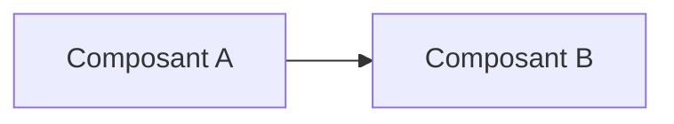

# ADR-NNN — <Titre court à l'impératif>

> Remplace `NNN` par le prochain numéro disponible dans `doc/architecture/`.
> Le titre est court, à l'impératif (« Adopter X », « Migrer vers Y »).

---

**Statut** : `Proposé` | `Accepté` | `Déprécié` | `Remplacé par ADR-MMM`
**Date** : YYYY-MM-DD
**Décideur** : Pilote (session principale)
**Contributeurs** :
- Proposition : `<agent constructeur, ex. Archi>`
- Contradictions : `<liste des contradicteurs ayant signé>`
- Synthèse : Scribe

---

## Contexte

Quel problème, quelles contraintes, quel déclencheur. 5 à 15 lignes max.
Si plus, c'est qu'il y a deux problèmes cachés en un — les séparer en 2 ADR.

## Décision

Une phrase à l'impératif. Ce qui est décidé, sans condition.

> Exemple : « Nous adoptons PostgreSQL comme stockage primaire de la couche
> métier, en remplacement de MongoDB. »

## Alternatives considérées

### Option A — `<nom>`
- Description : ...
- Avantages : ...
- Inconvénients : ...
- Raison de l'écart : ...

### Option B — `<nom>`
- ...

### Option C — Ne rien faire
*(Toujours présente. Si elle n'a pas de sens dans le contexte, dire pourquoi.)*

## Conséquences

### Positives
- ...

### Négatives / risques résiduels acceptés
- ...

### Travail induit
- Code : ...
- Tests : ...
- Documentation : ...
- Migration : ...
- Formation équipe : ...

## Contradictions signées

> Bloc obligatoire pour les décisions L4 et L5. Si vide pour L4+, c'est un défaut
> de procédure — l'ADR n'est pas valide.

### Critik
> ...

### Sentinel
> ...

### Devil
> ...

## Arbitrage du Pilote

> Pourquoi cette décision malgré les contradictions ? Quel(s) point(s) ont été
> retenus, lesquels écartés et pourquoi.

## Diagramme

> Si pertinent, joindre un diagramme Mermaid.

## Liens

- US liées : `doc/backlog/...`
- ADR liés : `ADR-NNN`, `ADR-MMM`
- Documentation technique : `doc/technical/...`
- Tickets / issues : ...

## Historique de l'ADR

| Date | Statut | Note |
|------|--------|------|
| YYYY-MM-DD | Proposé | Création |
| YYYY-MM-DD | Accepté | Après cycle adversarial |
